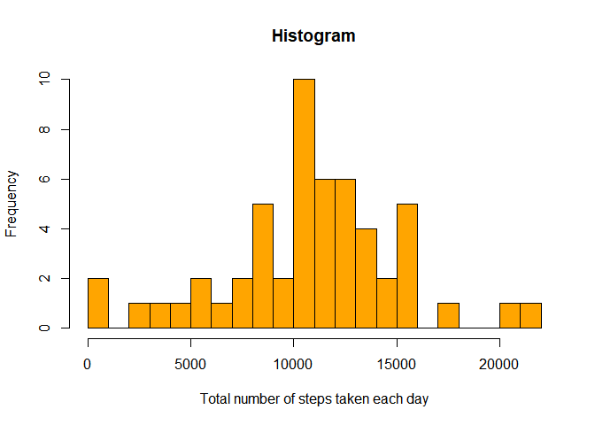
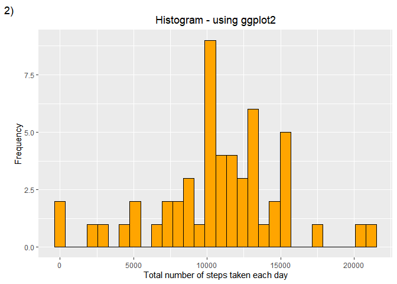
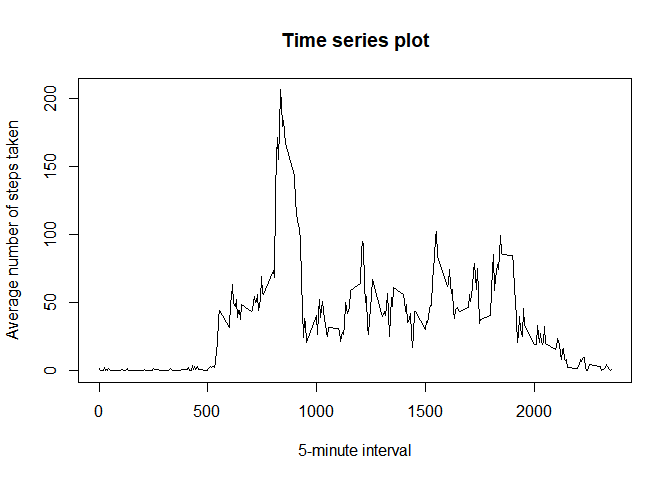
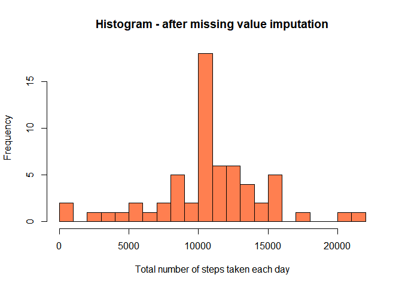
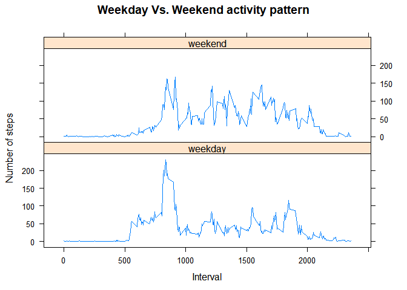

-   [1. Loading and preprocessing the
    data](#loading-and-preprocessing-the-data)
-   [2. What is mean total number of steps taken per
    day?](#what-is-mean-total-number-of-steps-taken-per-day)
    -   [2.1 The total number of steps taken each
        day:](#the-total-number-of-steps-taken-each-day)
    -   [2.2 The histogram of the total number of steps taken each
        day:](#the-histogram-of-the-total-number-of-steps-taken-each-day)
    -   [2.3 The histogram of the total number of steps taken each day:
        using
        ggplot2](#the-histogram-of-the-total-number-of-steps-taken-each-day-using-ggplot2)
    -   [2.4 The mean of the total number of steps taken per
        day](#the-mean-of-the-total-number-of-steps-taken-per-day)
    -   [2.5 The median of the total number of steps taken per
        day](#the-median-of-the-total-number-of-steps-taken-per-day)
-   [3. What is the average daily activity
    pattern?](#what-is-the-average-daily-activity-pattern)
    -   [3.1 Time series plot](#time-series-plot)
    -   [3.2 The 5-minute interval that has the max. no. of
        steps](#the-5-minute-interval-that-has-the-max.-no.-of-steps)
-   [4. Imputing missing values](#imputing-missing-values)
    -   [4.1 The total number of missing values in the
        dataset:](#the-total-number-of-missing-values-in-the-dataset)
    -   [4.2 Strategy for filling missing
        values](#strategy-for-filling-missing-values)
    -   [4.3 The new dataset with the missing data filled
        in.](#the-new-dataset-with-the-missing-data-filled-in.)
    -   [4.4 Histogram of the total number of steps taken each day -
        after
        imputation](#histogram-of-the-total-number-of-steps-taken-each-day---after-imputation)
-   [5. Are there differences in activity patterns between weekdays and
    weekends?](#are-there-differences-in-activity-patterns-between-weekdays-and-weekends)
    -   [5.1 Creating new factor
        variable](#creating-new-factor-variable)
    -   [5.2 Panel plot](#panel-plot)

1. Loading and preprocessing the data
-------------------------------------

  

    fileUrl <- "https://d396qusza40orc.cloudfront.net/repdata%2Fdata%2Factivity.zip"
    if(!file.exists("activity.zip")){
      download.file(fileUrl,
        destfile="activity.zip",
        method="curl")
    }

    if(!file.exists("activity.csv")){
        unzip("activity.zip")
    }  
      
    activity = read.csv(
        "activity.csv",
        stringsAsFactors=F,
        colClasses = c("numeric", "character", "numeric")
    )
    activity$date <- as.Date(activity$date, 
      format = "%Y-%m-%d")

2. What is mean total number of steps taken per day?
----------------------------------------------------

  

### 2.1 The total number of steps taken each day:

  
For this part of the assignment, the rows with missing values from the
dataset are not considered.

    activityGood <- activity[complete.cases(activity), ]

    stepsPerDay <- activityGood %>% 
        group_by(date) %>% 
        summarise(TotalStepsPerDay=sum(steps)) %>% 
        data.frame()

### 2.2 The histogram of the total number of steps taken each day:

  

    hist(
        stepsPerDay$TotalStepsPerDay,
        main= "Histogram",
        xlab="Total number of steps taken each day" ,
        breaks= 25,
        col= "orange",
        border = "black"
    )

### 2.3 The histogram of the total number of steps taken each day: using ggplot2

  

    library(ggplot2)
    ggplot(stepsPerDay, aes(x=TotalStepsPerDay)) + 
      geom_histogram(
        color="black", 
        fill="orange", 
        bins = 30) +
      labs(
        title="Histogram - using ggplot2",
        tag = "2)",
        x="Total number of steps taken each day", 
        y = "Frequency")+
      theme(plot.title= element_text(hjust = 0.5))

  

### 2.4 The mean of the total number of steps taken per day

    mean(stepsPerDay$TotalStepsPerDay)

    [1] 10766.19

### 2.5 The median of the total number of steps taken per day

    median(stepsPerDay$TotalStepsPerDay)

    [1] 10765

3. What is the average daily activity pattern?
----------------------------------------------

1.  Make a time series plot of the 5-minute interval (x-axis) and the
    average number of steps taken, averaged across all days (y-axis)

### 3.1 Time series plot

    avDailyActivityPattern <- activity %>% 
        group_by(interval) %>% 
        summarise(AverageStepsPerInterval=mean(steps, na.rm=TRUE)) %>% 
        data.frame()

    plot(avDailyActivityPattern$interval,
         avDailyActivityPattern$AverageStepsPerInterval,
         type="l",
         ylab="Average number of steps taken",
         xlab="5-minute interval",
         main="Time series plot"
    )

### 3.2 The 5-minute interval that has the max. no. of steps

1.  Which 5-minute interval, on average across all the days in the
    dataset, contains the maximum number of steps?

<!-- -->

    avDailyActivityPattern[
      which.max(avDailyActivityPattern$AverageStepsPerInterval), "interval"]

    [1] 835

4. Imputing missing values
--------------------------

### 4.1 The total number of missing values in the dataset:

1.  Calculate and report the total number of missing values in the
    dataset (i.e. the total number of rows with NAs

<!-- -->

    sum(is.na(activity))

    [1] 2304

### 4.2 Strategy for filling missing values

The mean for the 5-minute interval is used for filling in missing
values.

### 4.3 The new dataset with the missing data filled in.

    avDailyActivity <- activity %>% 
        group_by(interval) %>% 
        summarise(AverageStepsPerInterval=mean(steps, na.rm=TRUE)) %>% 
        data.frame()

    newActivity <- activity
    for (i in 1:nrow(newActivity)){
        if(is.na(newActivity$steps[i])){
                newActivity$steps[i] = (avDailyActivity %>%
                filter (interval == newActivity$interval[i]))$AverageStepsPerInterval
        }
      
    }     
    sum(is.na(newActivity))

    [1] 0

### 4.4 Histogram of the total number of steps taken each day - after imputation

1.  Make a histogram of the total number of steps taken each day and
    Calculate and report the mean and median total number of steps taken
    per day. Do these values differ from the estimates from the first
    part of the assignment? What is the impact of imputing missing data
    on the estimates of the total daily number of steps?  

<!-- -->

     stepsPerDayNew <- newActivity %>% 
        group_by(date) %>% 
        summarise(TotalStepsPerDay=sum(steps)) %>% 
        data.frame()

    hist(
        stepsPerDayNew$TotalStepsPerDay,
        xlab="Total number of steps taken each day" ,
        breaks= 25,
        col= "coral",
        border = "black",
        main = "Histogram - after missing value imputation"
    )  

    mean(stepsPerDayNew$TotalStepsPerDay)

    [1] 10766.19

    median(stepsPerDayNew$TotalStepsPerDay)

    [1] 10766.19

#### Observations

The mean total number of steps taken per day remains the same after
imputing missing values for steps using the mean for that 5-minute
interval. However, the median total number of steps taken per day
differs slightly.

5. Are there differences in activity patterns between weekdays and weekends?
----------------------------------------------------------------------------

(Use the dataset with the filled-in missing values for this part.)

### 5.1 Creating new factor variable

1.  Create a new factor variable in the dataset with two levels
    indicating whether a given date is a weekday or weekend day.

<!-- -->

    newActivity$weekdays <- weekdays(newActivity$date)

    newActivity$weekFactor <- as.factor( ifelse (
        grepl("Saturday|Sunday", newActivity$weekdays), 
        "weekend", "weekday" )
    )

    head(newActivity)

          steps       date interval weekdays weekFactor
    1 1.7169811 2012-10-01        0   Monday    weekday
    2 0.3396226 2012-10-01        5   Monday    weekday
    3 0.1320755 2012-10-01       10   Monday    weekday
    4 0.1509434 2012-10-01       15   Monday    weekday
    5 0.0754717 2012-10-01       20   Monday    weekday
    6 2.0943396 2012-10-01       25   Monday    weekday

    str(newActivity)

    'data.frame':   17568 obs. of  5 variables:
     $ steps     : num  1.717 0.3396 0.1321 0.1509 0.0755 ...
     $ date      : Date, format: "2012-10-01" "2012-10-01" ...
     $ interval  : num  0 5 10 15 20 25 30 35 40 45 ...
     $ weekdays  : chr  "Monday" "Monday" "Monday" "Monday" ...
     $ weekFactor: Factor w/ 2 levels "weekday","weekend": 1 1 1 1 1 1 1 1 1 1 ...

### 5.2 Panel plot

2.Make a panel plot containing a time series plot (type="l") of the
5-minute interval (x-axis) and the average number of steps taken,
averaged across all weekday days or weekend days (y-axis).

#### Average no: of steps taken/5-minute interval, across weekdays and weekends

    library ("lattice")
    weeklySteps <- newActivity %>% 
        group_by(weekFactor, interval) %>% 
        summarize(steps =mean(steps)) %>% 
        as.data.frame()

    xyplot(steps ~ interval | weekFactor, 
        weeklySteps , 
        type="l", 
        layout = c(1, 2), 
        xlab="Interval", 
        ylab="Number of steps", 
        main="Weekday Vs. Weekend activity pattern")

